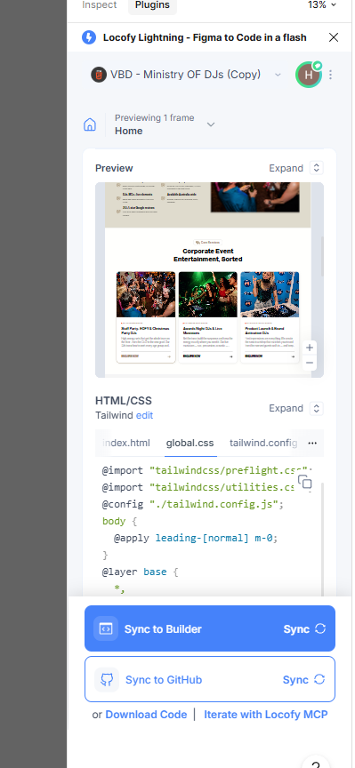

# VBD - Ministry of DJs

This website was generated from a Figma design using the **[Locofy.ai](https://www.locofy.ai/)** plugin, which converts Figma designs into production-ready front-end code (HTML + Tailwind CSS, bundled with Parcel).

## Preview

### Full Page Render (localhost)

## Completion Status

The generated website is currently at approximately **70% fidelity compared to the original Figma design**. The overall layout, sections, images, and content are in place, but some spacing, responsive behavior, and visual details still need manual refinement to fully match the original design.

## Tech Stack

- **Locofy.ai** — Figma-to-code plugin used to generate this project
- **Tailwind CSS v4** — utility-first styling
- **Parcel** — bundler / dev server

## How to Run

Requires [Node.js](https://nodejs.org/en/download/).

1. Open the project folder in your editor
2. Run `npm install`
3. Run `npm start` and open http://localhost:1234 in your browser

To build a static version for deployment, run `npm run build` (output goes to the `build/` folder).
